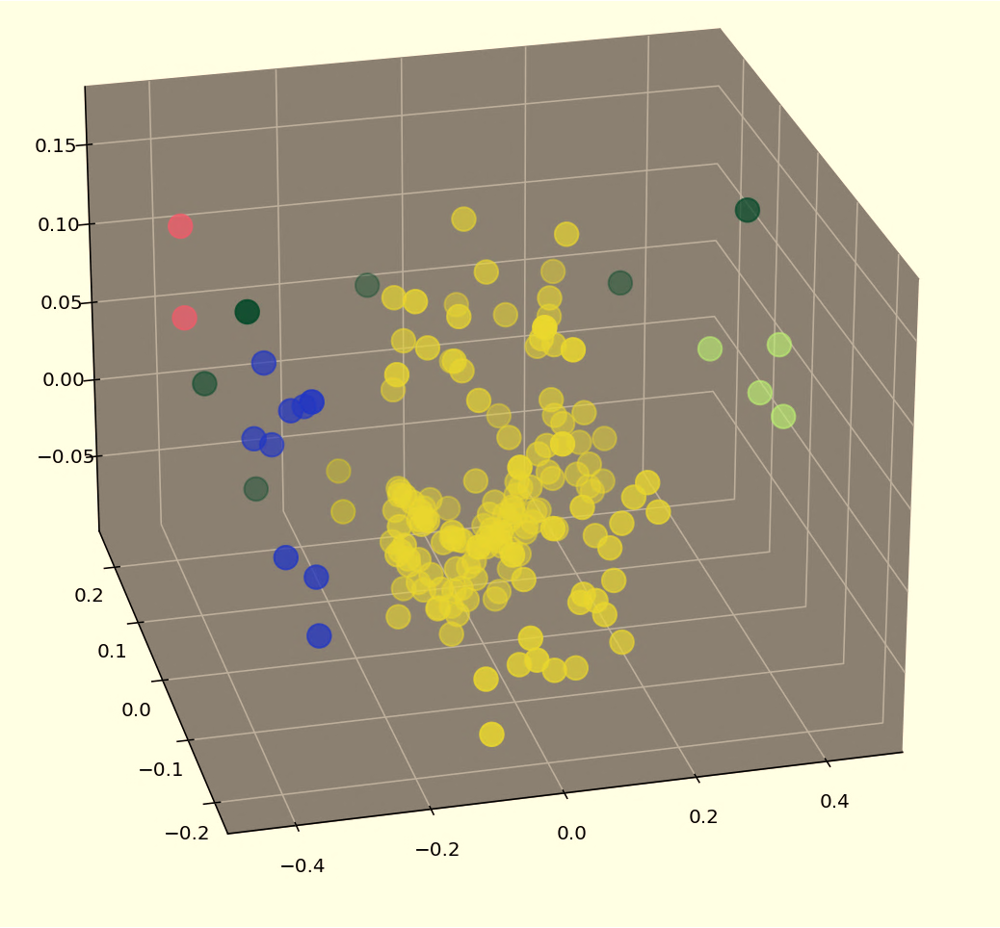
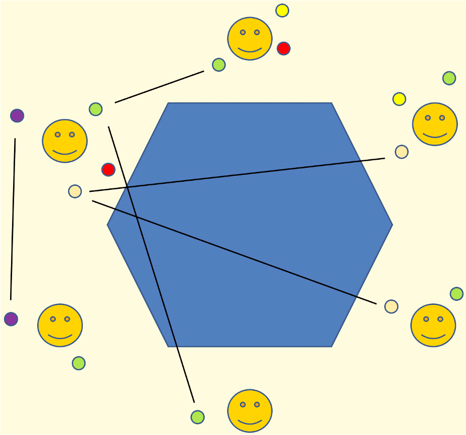

# Clustering with DBSCAN and the Banquet Table

It is customary in material analyses of collections to identify physically similar groups of items, or clusters. Once you’ve given each item in the collection a suitable numerical representation—in this case, a vector that indicates the position of that item in material space—you can use that representation to find clusters in the data.

Most ordinary clustering algorithms—e.g., k-means, hierarchical, spectral—are exhaustive algorithms, meaning that every item in the data is placed in a cluster, and the number of clusters must be chosen beforehand. And for certain distributions of data, this is fine. But when your data are not particularly “clumpy”, this can lead to outliers being forced into clusters where they don’t strictly belong.

And this is our situation—the data are distributed pretty evenly across the expressive space, and there are few obvious clusters (see Figure 1, below). But there are small clusters of highly similar papers, and we want to find them.

> 
>
> **FIGURE 1.** A 3D scatterplot showing the distribution of our print collection data across the expressive space. At a glance, it is not at all obvious how these data should be grouped. The point colors represent the cluster assignments of an exhaustive algorithm, and it’s clear that the results are unsatisfactory, with outlier points forced into clusters and arbitrary dividing lines between clusters.

We need a non-exhaustive clustering algorithm—one that allows outlier points to remain unclustered—and we’d prefer to let the data distribution dictate the number of clusters, rather than choosing it ourselves. One such algorithm, in wide use in data applications today, is Density-Based Spatial Clustering of Applications with Noise or DBSCAN. DBSCAN finds the densest regions of the data space and begins building clusters from those cores. Once this iterative process has finished, any unclustered points will be designated as “noise”. The parameters that govern this process are set by the user and can be more or less permissive in choosing additions to a cluster.

But there is a problem with DBSCAN used “out-of-the-box”—it is ordinarily applied in cases where the native dimensionality of the data is very high and there is an abundance of empty space. In such contexts, clusters can be of any shape and remain clearly set apart from one another. But in low-dimensional spaces like ours, any cluster shapes that deviate significantly from “round” (in our case, a 4D hypersphere) will contain points that are too far apart—farther, in many cases, than points in other nearby clusters. We want to find photographic papers that are all of them highly similar, and unmodified applications of DBSCAN allow for clusters that are merely contiguous across the feature space, regardless of the degree of similarity between points at the extremes (Figure 2).

> 
>
> **FIGURE 2.** The data points in Figure 1, clustered using unmodified DBSCAN. The results are better, with the noise cluster in dark green. But the large central cluster of yellow points stretches too far across the feature space, and points at opposite ends of its boundaries will be dissimilar as a result.

Accordingly, we need to modify DBSCAN by adding a constraint we call the _banquet table_. The banquet table constraint conceives of collection items as banquet attendees that sit together at banquet tables (i.e., clusters). Attendees can invite _guests_; a guest for collection print `p` is any paper from our reference collection within distance `d` of `p` in expressive space. In order for two collection items to sit at the same table, they must share at least one guest (Figure 3).

> 
>
> **FIGURE 3.** An illustration of the banquet table constraint. Banquet attendees (i.e., collection prints, depicted as yellow smileys) invite guests (i.e., reference collection papers, depicted as small colored dots), and any two attendees tabled together must share at least one guest. In this graphic, shared guests are traced between one attendee and all others. Note, however, that the constraint requires that we be able to do this for every attendee.

The distance `d` is chosen ahead of time and is based on the average distance between reference collection measurements made on the same leaves of paper. Because the banquet constraint applies to every pair of collection items in a cluster, including those sitting “opposite” each other, the constraint enforces tight, round clusters and thus ensures high intra-cluster similarity.

Once we’ve chosen `d`, we have a well-defined concept of guest and can determine which tablings (i.e., clusterings) are allowable. But how do we choose a tabling? Luckily, DBSCAN uses its own distance parameter, `epsilon`, that, as it happens, can be used to define a threshold between permissible and impermissible tablings. We choose the maximum value of `epsilon` that still yields an allowable tabling. This will maximize the number of tabled attendees.

There are three categories of untabled attendees of interest to us. The first are lonelies. Lonelies cannot have guests, because there are no papers in our reference collection within distance `d`. These are interesting because—assuming our reference collection is a suitably comprehensive—they are likely to be highly unique papers, both within their print collection and elsewhere. The second group are outsiders, who have guests but share no guests with any other attendees. Outsiders are interesting because they are unique papers within their collections. 

The tabling of lonelies and outsiders is strictly impossible once we’ve chosen `d`, and thus we might say they are not in attendance at all. But members of the third group, noise, will be tableable for certain settings of epsilon, and can thus be viewed as attendees who show up to the banquet but never find a suitable table. These cases are the toughest to interpret and may sit on the borderline in some of our analyses—for example, it may make sense to consider, for a given noise item, which clusters are nearby.
